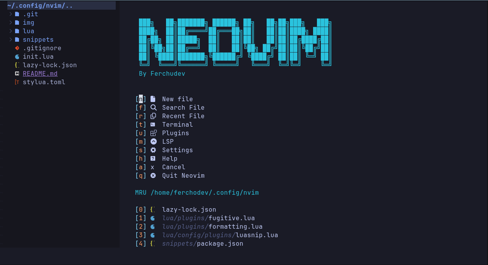

# My nvim configuration

## Screenshot

## Plugins

- [Autopairs](https://github.com/windwp/nvim-autopairs)

- [Cmp](https://github.com/hrsh7th/nvim-cmp)

- [LSP](https://github.com/neovim/nvim-lspconfig)

- [Codeium](https://github.com/Exafunction/codeium.vim)

- [Colorscheme](https://github.com/norcalli/nvim-colorizer.lua)

- [Comment](https://github.com/numToStr/Comment.nvim)

- [Devicons](https://github.com/nvim-tree/nvim-web-devicons)

- [Formatting](https://github.com/stevearc/conform.nvim)

### Git integrations

- [fugitive](https://github.com/tpope/vim-fugitive)
- [gitsigns](https://github.com/lewis6991/gitsigns.nvim)

- [Lualine](https://github.com/nvim-lualine/lualine.nvim)

- [Luasnip](https://github.com/L3MON4D3/LuaSnip)
