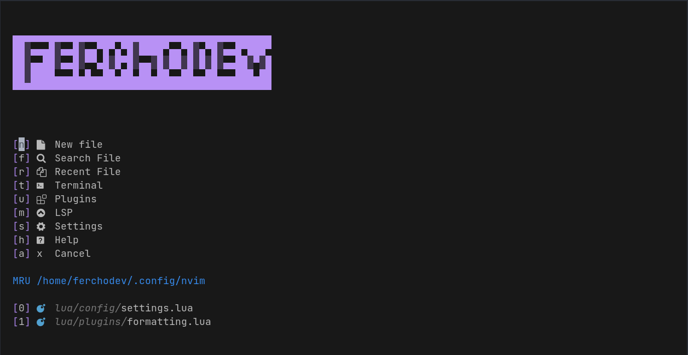

# My config of nvim.

## Screenshot

## Plugins

- [Autopairs](https://github.com/windwp/nvim-autopairs)

- Completion

  - [Cmp](https://github.com/hrsh7th/nvim-cmp)
  - [LSP](https://github.com/neovim/nvim-lspconfig)

- [Color-picker](https://github.com/ziontee113/color-picker.nvim)

- [Colorscheme](https://github.com/norcalli/nvim-colorizer.lua)

- [Comment](https://github.com/numToStr/Comment.nvim)

- [Devicons](https://github.com/nvim-tree/nvim-web-devicons)

- [Formatting](https://github.com/stevearc/conform.nvim)

- [Git integrations](https://git-scm.com)

  - [fugitive](https://github.com/tpope/vim-fugitive)
  - [gitsigns](https://github.com/lewis6991/gitsigns.nvim)

- [Lualine](https://github.com/nvim-lualine/lualine.nvim)

- [Luasnip](https://github.com/L3MON4D3/LuaSnip)

- [MarkdownPreview](https://github.com/iamcco/markdown-preview.nvim)
# programacion-pedro
